# Game Entities Module Documentation

## Overview

The **game_entities** module provides the foundational game object classes for an Asteroids-style game. It implements a sprite-based entity system with a common base class (`CircleShape`) that enables consistent collision detection, rendering, and physics simulation across all interactive game objects. The module includes the player spacecraft, asteroids, and projectile shots.

## Purpose

This module serves as the core entity layer of the game, providing:
- **Base entity framework**: A unified `CircleShape` base class for all circular game objects
- **Player control**: A controllable spacecraft with rotation, movement, and shooting capabilities
- **Asteroid entities**: Destructible obstacles with splitting mechanics
- **Projectile system**: Shot entities fired by the player
- **Collision detection**: Circle-based collision detection for all entities
- **Sprite management**: Integration with Pygame's sprite system for efficient rendering and updates

## Architecture Overview

The game_entities module follows an object-oriented inheritance hierarchy where all game objects derive from a common `CircleShape` base class. This design enables polymorphic behavior and consistent collision detection across different entity types.

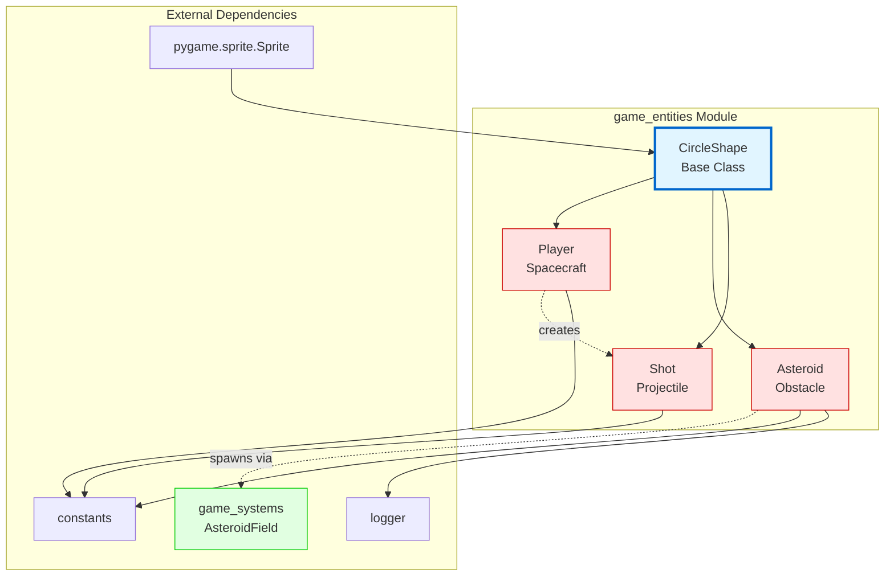

### Class Hierarchy

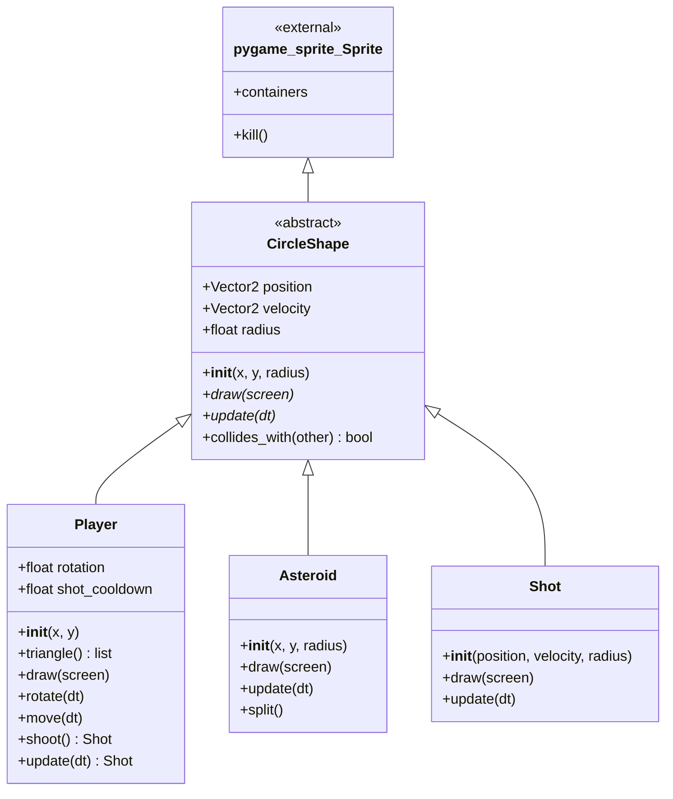

## Core Components

### 1. CircleShape (Base Class)

**Purpose**: Abstract base class for all circular game entities, providing common functionality for position, velocity, collision detection, and sprite management.

**Key Responsibilities**:
- Manage entity position and velocity as 2D vectors
- Define collision radius for circle-based collision detection
- Integrate with Pygame's sprite container system
- Provide abstract interface for drawing and updating

**Attributes**:
- `position` (pygame.Vector2): Current position in 2D space
- `velocity` (pygame.Vector2): Movement vector (pixels per second)
- `radius` (float): Collision radius for circle-based detection

**Methods**:
- `__init__(x, y, radius)`: Initialize position and radius, register with sprite containers
- `draw(screen)`: Abstract method for rendering (must be overridden)
- `update(dt)`: Abstract method for updating state (must be overridden)
- `collides_with(other)`: Check collision with another CircleShape using distance calculation

**Design Pattern**: Template Method pattern - defines the skeleton of entity behavior while allowing subclasses to override specific steps.

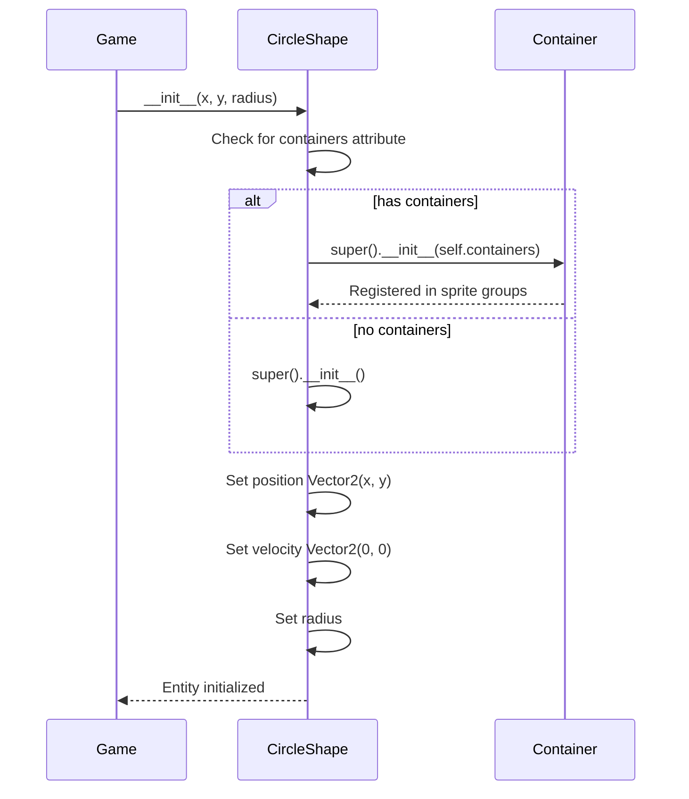

### 2. Player (Spacecraft)

**Purpose**: Represents the player-controlled spacecraft with movement, rotation, and shooting capabilities.

**Key Responsibilities**:
- Handle keyboard input for movement and rotation
- Manage shooting mechanics with cooldown system
- Render as a triangular ship pointing in the direction of rotation
- Create shot projectiles when firing

**Attributes**:
- `rotation` (float): Current rotation angle in degrees
- `shot_cooldown` (float): Time remaining before next shot can be fired
- Inherits: `position`, `velocity`, `radius` from CircleShape

**Methods**:
- `__init__(x, y)`: Initialize player at position with PLAYER_RADIUS
- `triangle()`: Calculate three vertices of the ship triangle based on rotation
- `draw(screen)`: Render the ship as a white polygon
- `rotate(dt)`: Rotate the ship by PLAYER_TURN_SPEED * dt
- `move(dt)`: Move the ship forward/backward in the direction of rotation
- `shoot()`: Create a Shot projectile if cooldown allows
- `update(dt)`: Process keyboard input and update cooldown

**Input Mapping**:
- `A` key: Rotate counter-clockwise
- `D` key: Rotate clockwise
- `W` key: Move forward
- `S` key: Move backward
- `SPACE` key: Shoot

**Constants Used**:
- `PLAYER_RADIUS`: Size of the player collision circle
- `PLAYER_TURN_SPEED`: Rotation speed in degrees per second
- `PLAYER_SPEED`: Movement speed in pixels per second
- `PLAYER_SHOT_SPEED`: Initial velocity of fired shots
- `PLAYER_SHOOT_COOLDOWN_SECONDS`: Time between shots
- `SHOT_RADIUS`: Radius of created shot projectiles
- `LINE_WIDTH`: Width of the ship outline

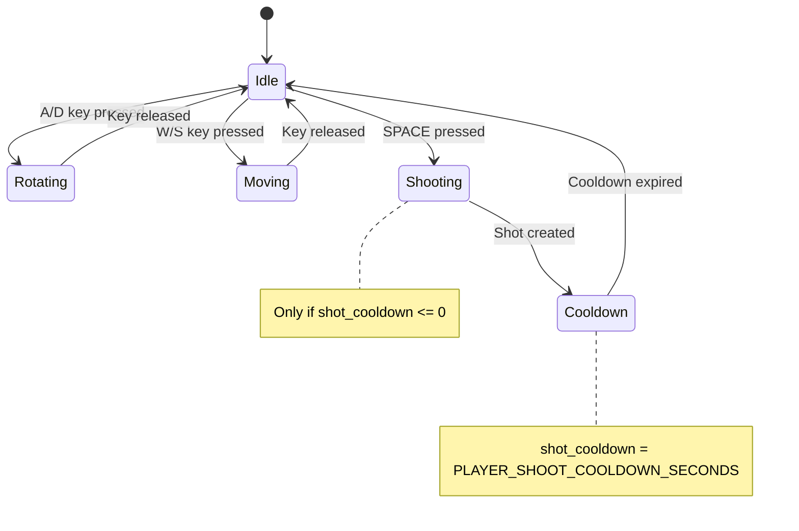

### 3. Asteroid (Obstacle)

**Purpose**: Represents destructible asteroid obstacles that split into smaller asteroids when destroyed.

**Key Responsibilities**:
- Move through space with constant velocity
- Render as a circular outline
- Split into two smaller asteroids when destroyed
- Log split events for analytics
- Remove itself when radius is below minimum threshold

**Attributes**:
- Inherits: `position`, `velocity`, `radius` from CircleShape

**Methods**:
- `__init__(x, y, radius)`: Initialize asteroid with position and size
- `draw(screen)`: Render as a white circle outline
- `update(dt)`: Update position based on velocity
- `split()`: Destroy this asteroid and spawn two smaller ones

**Split Mechanics**:
1. Log the split event
2. Remove the current asteroid from sprite groups (`kill()`)
3. If radius < ASTEROID_MIN_RADIUS, don't spawn children
4. Otherwise, calculate new radius: `ASTEROID_MIN_RADIUS * (kind - 1)` where `kind = radius // ASTEROID_MIN_RADIUS`
5. Spawn two new asteroids at the same position
6. Apply rotated velocity (±45° random) with 1.2x speed multiplier
7. Use AsteroidField to spawn the new asteroids

**Constants Used**:
- `ASTEROID_MIN_RADIUS`: Minimum size before asteroid stops splitting
- `LINE_WIDTH`: Width of the circle outline

**External Dependencies**:
- `logger.log_event()`: Records asteroid split events
- `game_systems.AsteroidField`: Manages asteroid spawning (see [game_systems](game_systems.md))

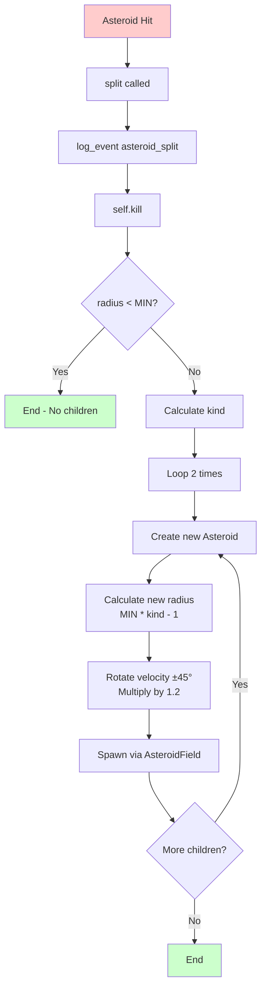

### 4. Shot (Projectile)

**Purpose**: Represents a projectile fired by the player that travels in a straight line.

**Key Responsibilities**:
- Move in a straight line with constant velocity
- Render as a small circular outline
- Provide collision detection for hitting asteroids

**Attributes**:
- Inherits: `position`, `velocity`, `radius` from CircleShape

**Methods**:
- `__init__(position, velocity, radius=SHOT_RADIUS)`: Initialize shot with position, velocity, and optional radius
- `draw(screen)`: Render as a white circle outline
- `update(dt)`: Update position based on velocity

**Creation Flow**:
- Created by `Player.shoot()` method
- Initial position: Player position + forward direction * player radius (spawns at ship's nose)
- Initial velocity: Forward direction * PLAYER_SHOT_SPEED
- Radius: SHOT_RADIUS constant

**Constants Used**:
- `SHOT_RADIUS`: Size of the shot collision circle
- `LINE_WIDTH`: Width of the circle outline

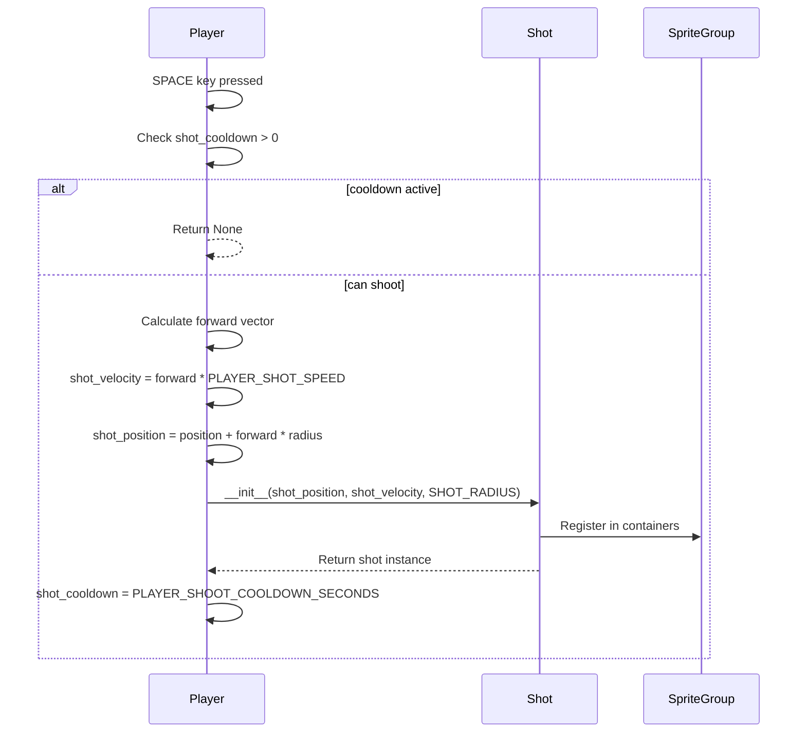

## Data Flow

### Entity Update Cycle

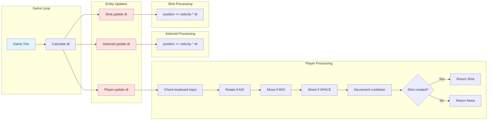

### Collision Detection Flow

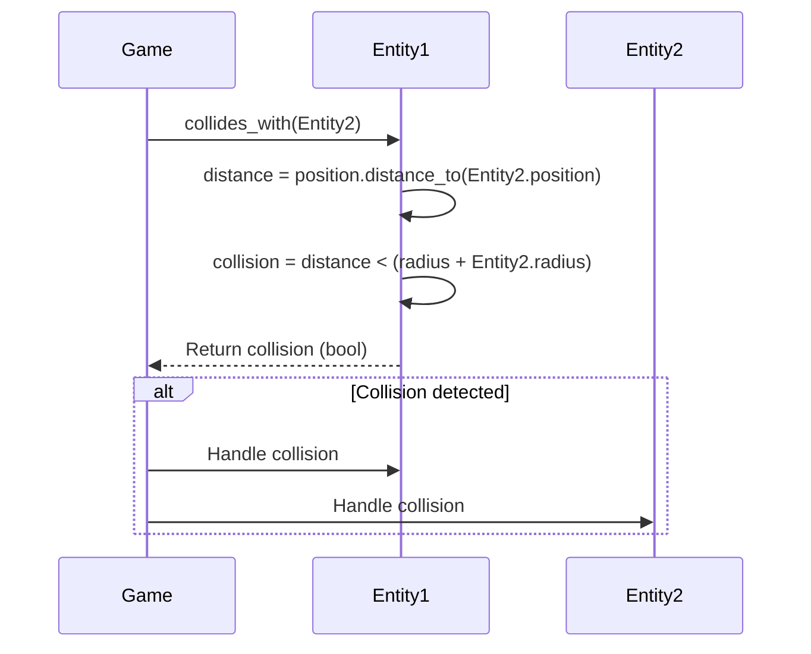

### Asteroid Split Process

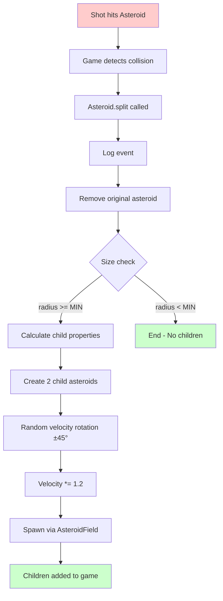

## Component Interactions

### Player-Shot Interaction

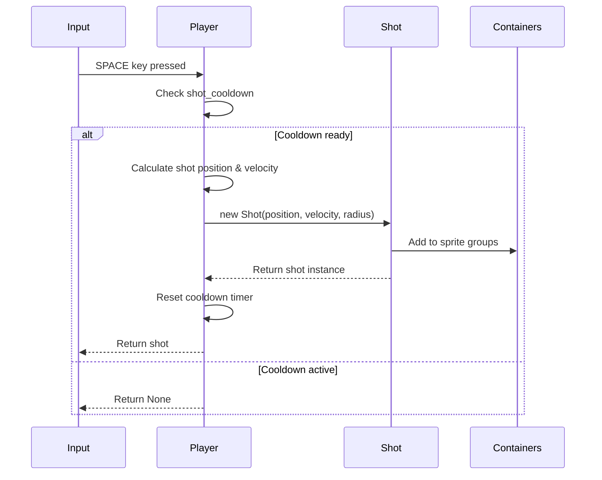

### Asteroid-AsteroidField Interaction

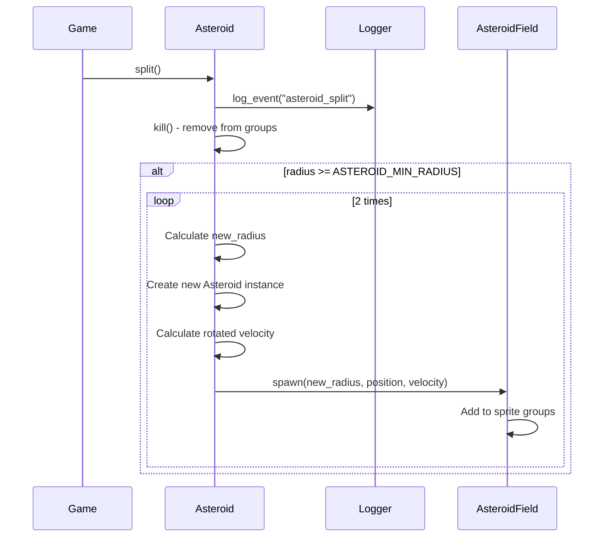

## Integration with Game Systems

The game_entities module integrates with other game systems as follows:

### Sprite Container System

All entities use Pygame's sprite container system for efficient group management:

```python
# Entities check for 'containers' attribute during initialization
if hasattr(self, "containers"):
    super().__init__(self.containers)  # Register with sprite groups
```

This allows the game to manage entities in groups (e.g., all_sprites, asteroids, shots) for batch updates and collision detection.

### AsteroidField Integration

Asteroids interact with the `AsteroidField` system (see [game_systems](game_systems.md)) for spawning:

```python
# In Asteroid.split()
from asteroidfield import AsteroidField
AsteroidField().spawn(new_radius, self.position, new_velocity)
```

This creates a dependency on the game_systems module for asteroid lifecycle management.

### Constants Configuration

All entities depend on a centralized constants module for configuration:

- **Player constants**: PLAYER_RADIUS, PLAYER_TURN_SPEED, PLAYER_SPEED, PLAYER_SHOT_SPEED, PLAYER_SHOOT_COOLDOWN_SECONDS
- **Asteroid constants**: ASTEROID_MIN_RADIUS
- **Shot constants**: SHOT_RADIUS
- **Rendering constants**: LINE_WIDTH

### Event Logging

Asteroids log split events using the logger module:

```python
from logger import log_event
log_event("asteroid_split")
```

This enables analytics and debugging of game events.

## Design Patterns

### 1. Template Method Pattern

`CircleShape` defines the template for all entities:
- Abstract methods (`draw`, `update`) must be implemented by subclasses
- Concrete methods (`collides_with`) provide shared functionality

### 2. Factory Pattern (Implicit)

- `Player.shoot()` acts as a factory method for creating Shot instances
- `Asteroid.split()` acts as a factory method for creating child Asteroids

### 3. Sprite Pattern

All entities inherit from `pygame.sprite.Sprite` for:
- Automatic group management
- Batch rendering and updates
- Efficient collision detection

### 4. Composition over Inheritance

Entities use `pygame.Vector2` for position and velocity rather than implementing vector math themselves.

## Physics and Mathematics

### Collision Detection

Circle-to-circle collision using distance formula:

```python
distance = self.position.distance_to(other.position)
collision = distance < (self.radius + other.radius)
```

**Mathematical basis**: Two circles collide when the distance between their centers is less than the sum of their radii.

### Player Movement

Forward movement uses rotation matrix:

```python
unit_vector = pygame.Vector2(0, 1)  # Up direction
rotated_vector = unit_vector.rotate(self.rotation)
displacement = rotated_vector * PLAYER_SPEED * dt
```

**Mathematical basis**: 2D rotation matrix applied to unit vector, scaled by speed and delta time.

### Player Triangle Rendering

Ship vertices calculated using rotation and offset:

```python
forward = pygame.Vector2(0, 1).rotate(self.rotation)
right = pygame.Vector2(0, 1).rotate(self.rotation + 90) * self.radius / 1.5
a = self.position + forward * self.radius  # Nose
b = self.position - forward * self.radius - right  # Left wing
c = self.position - forward * self.radius + right  # Right wing
```

**Mathematical basis**: Polar coordinates converted to Cartesian for triangle vertices.

### Asteroid Split Velocity

Child asteroids receive rotated and amplified velocity:

```python
new_velocity = self.velocity.rotate(random.randint(-45, 45)) * 1.2
```

**Mathematical basis**: Random rotation (±45°) adds unpredictability, 1.2x multiplier increases difficulty.

## Usage Examples

### Creating and Managing Entities

```python
import pygame
from player import Player
from asteroid import Asteroid
from shot import Shot

# Initialize sprite groups
all_sprites = pygame.sprite.Group()
asteroids = pygame.sprite.Group()
shots = pygame.sprite.Group()

# Set containers for automatic group registration
Player.containers = (all_sprites,)
Asteroid.containers = (all_sprites, asteroids)
Shot.containers = (all_sprites, shots)

# Create player
player = Player(400, 300)  # Center of screen

# Create asteroid
asteroid = Asteroid(100, 100, 50)  # Position (100, 100), radius 50
asteroid.velocity = pygame.Vector2(50, 30)  # Set velocity

# Game loop
dt = 0.016  # ~60 FPS
for sprite in all_sprites:
    sprite.update(dt)
    sprite.draw(screen)

# Check collisions
for asteroid in asteroids:
    if player.collides_with(asteroid):
        # Handle player-asteroid collision
        pass
    
    for shot in shots:
        if shot.collides_with(asteroid):
            asteroid.split()  # Split asteroid
            shot.kill()  # Remove shot
```

### Player Control Flow

```python
# In game loop
shot = player.update(dt)  # Returns Shot or None
if shot:
    # Shot was fired, already added to sprite groups via containers
    pass
```

### Asteroid Lifecycle

```python
# Create large asteroid
large_asteroid = Asteroid(200, 200, 60)
large_asteroid.velocity = pygame.Vector2(40, 20)

# When hit by shot
large_asteroid.split()
# Result: 
# - Original asteroid removed
# - Two medium asteroids created at same position
# - Each with rotated velocity (±45°) * 1.2

# When medium asteroid is hit
medium_asteroid.split()
# Result:
# - Medium asteroid removed
# - Two small asteroids created
# - Each with rotated velocity * 1.2

# When small asteroid is hit
small_asteroid.split()
# Result:
# - Small asteroid removed
# - No children created (below ASTEROID_MIN_RADIUS)
```

## Performance Considerations

### Sprite Groups

Using Pygame's sprite groups enables:
- **Batch updates**: `all_sprites.update(dt)` updates all entities efficiently
- **Batch rendering**: `all_sprites.draw(screen)` renders all entities
- **Efficient collision detection**: `pygame.sprite.groupcollide()` for group-to-group collisions

### Collision Detection Optimization

Circle-based collision is O(1) per pair:
- Simple distance calculation
- No complex polygon intersection tests
- Suitable for real-time game loops

### Memory Management

- `kill()` method removes sprites from all groups
- Automatic garbage collection when no references remain
- Asteroid splitting creates new objects but removes parent

## Error Handling and Edge Cases

### Circular Import Prevention

Both Player and Asteroid use local imports to avoid circular dependencies:

```python
# In Player.shoot()
from shot import Shot  # Import here to avoid circular dependency

# In Asteroid.split()
from asteroidfield import AsteroidField  # Import here to avoid circular dependency
```

### Shot Cooldown

Player prevents rapid-fire by checking cooldown:

```python
if self.shot_cooldown > 0:
    return None  # Can't shoot yet
else:
    self.shot_cooldown = PLAYER_SHOOT_COOLDOWN_SECONDS
    # Create and return shot
```

### Asteroid Minimum Size

Split method checks minimum radius to prevent infinite splitting:

```python
if self.radius < ASTEROID_MIN_RADIUS:
    return  # Don't create children
```

### Container Attribute Check

CircleShape safely handles missing containers:

```python
if hasattr(self, "containers"):
    super().__init__(self.containers)
else:
    super().__init__()  # No automatic group registration
```

## Testing Considerations

### Unit Testing

Key areas for unit tests:

1. **Collision Detection**:
   - Test `collides_with()` with various distances
   - Edge case: Exactly touching (distance == sum of radii)

2. **Player Movement**:
   - Test rotation calculations
   - Test forward/backward movement
   - Test triangle vertex calculations

3. **Asteroid Splitting**:
   - Test split with various radii
   - Test minimum radius threshold
   - Verify child count and properties

4. **Shot Creation**:
   - Test cooldown mechanism
   - Test shot position and velocity calculation

### Integration Testing

1. **Player-Shot Integration**:
   - Verify shot spawns at correct position
   - Verify shot has correct velocity
   - Verify cooldown prevents rapid fire

2. **Asteroid-AsteroidField Integration**:
   - Verify children spawn correctly
   - Verify velocity randomization
   - Verify logging occurs

3. **Sprite Container Integration**:
   - Verify entities register with groups
   - Verify `kill()` removes from all groups

## Future Enhancements

### Potential Improvements

1. **Entity Pooling**: Reuse shot/asteroid objects instead of creating new ones
2. **Spatial Partitioning**: Optimize collision detection for many entities
3. **Entity States**: Add state machines for more complex behaviors
4. **Power-ups**: Extend CircleShape for collectible items
5. **Particle Effects**: Add visual effects for explosions and thrust
6. **Sound Integration**: Add audio feedback for actions
7. **Configurable Difficulty**: Adjust constants based on game difficulty level

### Extensibility

The CircleShape base class makes it easy to add new entity types:

```python
class PowerUp(CircleShape):
    def __init__(self, x, y, power_type):
        super().__init__(x, y, POWERUP_RADIUS)
        self.power_type = power_type
    
    def draw(self, screen):
        # Custom rendering
        pass
    
    def update(self, dt):
        # Custom behavior (e.g., rotation, pulsing)
        pass
```

## Dependencies

### External Libraries

- **pygame**: Core game framework
  - `pygame.sprite.Sprite`: Base sprite class
  - `pygame.Vector2`: 2D vector mathematics
  - `pygame.draw`: Rendering primitives
  - `pygame.key`: Keyboard input

### Internal Modules

- **constants**: Game configuration values
- **logger**: Event logging system
- **game_systems** (AsteroidField): Asteroid spawning management (see [game_systems](game_systems.md))

### Dependency Graph

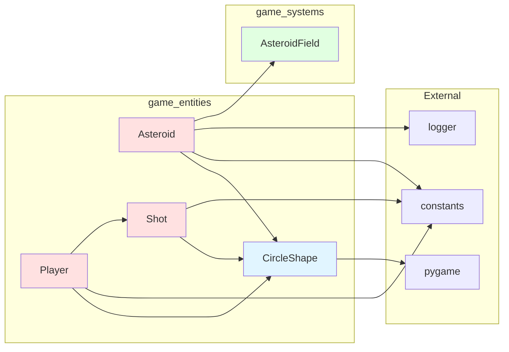

## Summary

The **game_entities** module provides a well-structured, extensible foundation for game objects in an Asteroids-style game. Key strengths include:

- **Clean inheritance hierarchy**: CircleShape base class provides consistent interface
- **Separation of concerns**: Each entity type has focused responsibilities
- **Efficient collision detection**: Circle-based detection is simple and fast
- **Sprite integration**: Leverages Pygame's sprite system for performance
- **Extensibility**: Easy to add new entity types by extending CircleShape

The module integrates seamlessly with the game_systems module (particularly AsteroidField) and provides the core gameplay mechanics for player control, asteroid obstacles, and projectile shooting.

For information about asteroid spawning and field management, see [game_systems](game_systems.md).
