# Game Systems Module Documentation

## Overview

The **game_systems** module provides the procedural generation and spawning systems for an Asteroids-style game. It implements a timer-based asteroid spawning mechanism that continuously generates asteroids from the edges of the screen, creating dynamic gameplay challenges. The module's primary component, `AsteroidField`, manages the lifecycle of asteroid creation with randomized properties to ensure varied and engaging gameplay.

## Purpose

This module serves as the game's content generation layer, providing:
- **Procedural asteroid spawning**: Automated generation of asteroids at configurable intervals
- **Edge-based spawning**: Asteroids spawn from screen edges and travel inward
- **Randomized properties**: Variable size, speed, direction, and spawn location for each asteroid
- **Difficulty scaling**: Configurable spawn rates and asteroid characteristics
- **Separation of concerns**: Decouples entity creation from entity behavior (see [game_entities](game_entities.md))

## Architecture Overview

The game_systems module implements a spawner pattern that operates independently of individual entity logic. It uses a timer-based system to periodically create new asteroids with randomized attributes, ensuring a continuous stream of challenges for the player.

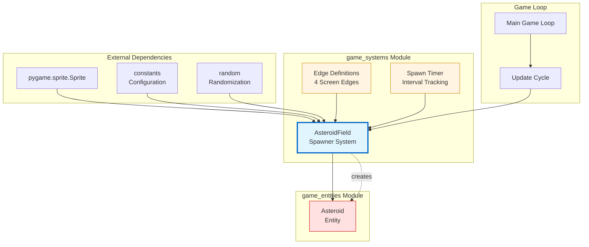

### System Architecture

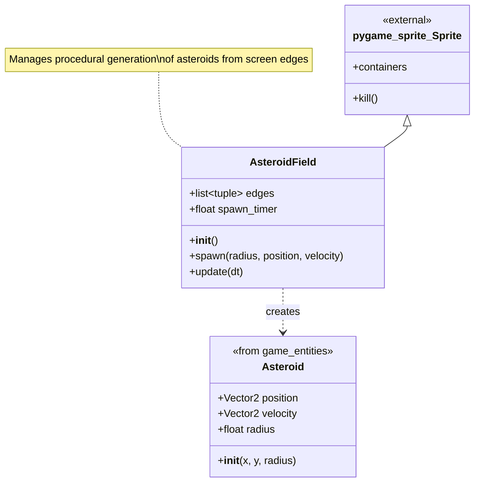

## Core Components

### AsteroidField (Spawner System)

**Purpose**: Manages the procedural generation of asteroids by spawning them at regular intervals from randomized screen edge positions with varied properties.

**Key Responsibilities**:
- Track spawn timing using an accumulating timer
- Select random spawn edges (top, bottom, left, right)
- Generate randomized asteroid properties (size, speed, direction)
- Create asteroid entities at calculated positions and velocities
- Integrate with Pygame's sprite container system

**Attributes**:
- `edges` (class variable): List of 4 edge definitions, each containing:
  - Direction vector (pygame.Vector2): Inward-pointing direction from edge
  - Position lambda: Function to calculate spawn position along edge
- `spawn_timer` (float): Accumulated time since last spawn (seconds)

**Methods**:
- `__init__()`: Initialize the spawner and register with sprite containers
- `spawn(radius, position, velocity)`: Create a new asteroid with specified properties
- `update(dt)`: Accumulate time and trigger spawns at configured intervals

**Constants Used**:
- `ASTEROID_SPAWN_RATE_SECONDS`: Time interval between spawns
- `ASTEROID_MAX_RADIUS`: Maximum asteroid size (used for edge offset)
- `ASTEROID_MIN_RADIUS`: Minimum asteroid size (base unit for sizing)
- `ASTEROID_KINDS`: Number of different asteroid size categories
- `SCREEN_WIDTH`: Width of the game screen
- `SCREEN_HEIGHT`: Height of the game screen

## Edge Definition System

The `AsteroidField` uses a sophisticated edge system to spawn asteroids from all four screen boundaries. Each edge is defined by a direction vector and a position calculation function.

### Edge Configuration

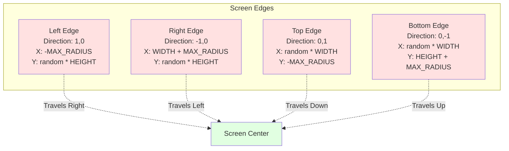

### Edge Data Structure

Each edge in the `edges` list is a tuple containing:

1. **Direction Vector** (pygame.Vector2): Base direction toward screen center
   - Left edge: `(1, 0)` - points right
   - Right edge: `(-1, 0)` - points left
   - Top edge: `(0, 1)` - points down
   - Bottom edge: `(0, -1)` - points up

2. **Position Lambda** (function): Calculates spawn position along edge
   - Takes random value `0.0` to `1.0` as parameter
   - Returns pygame.Vector2 with calculated position
   - Positions are offset by `ASTEROID_MAX_RADIUS` to spawn off-screen

```python
# Edge structure example
edges = [
    # Left edge
    [
        pygame.Vector2(1, 0),  # Direction: right
        lambda y: pygame.Vector2(-ASTEROID_MAX_RADIUS, y * SCREEN_HEIGHT)
    ],
    # Right edge
    [
        pygame.Vector2(-1, 0),  # Direction: left
        lambda y: pygame.Vector2(SCREEN_WIDTH + ASTEROID_MAX_RADIUS, y * SCREEN_HEIGHT)
    ],
    # Top edge
    [
        pygame.Vector2(0, 1),  # Direction: down
        lambda x: pygame.Vector2(x * SCREEN_WIDTH, -ASTEROID_MAX_RADIUS)
    ],
    # Bottom edge
    [
        pygame.Vector2(0, -1),  # Direction: up
        lambda x: pygame.Vector2(x * SCREEN_WIDTH, SCREEN_HEIGHT + ASTEROID_MAX_RADIUS)
    ]
]
```

## Spawn Process

### Timer-Based Spawning

The `AsteroidField` uses an accumulating timer to trigger spawns at regular intervals:

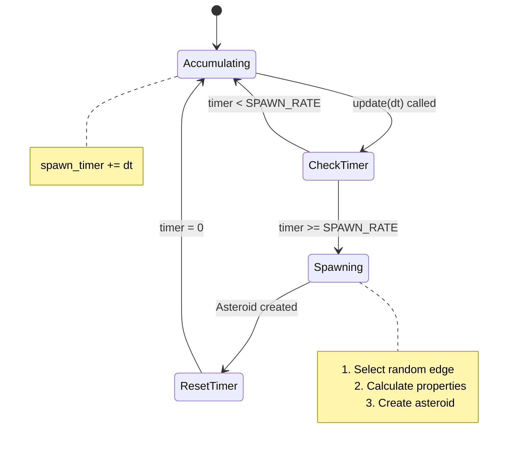

### Randomization Algorithm

When spawning an asteroid, the system randomizes multiple properties:

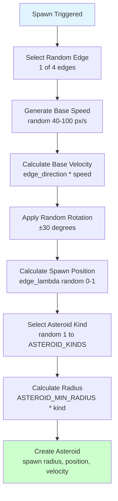

### Detailed Spawn Flow

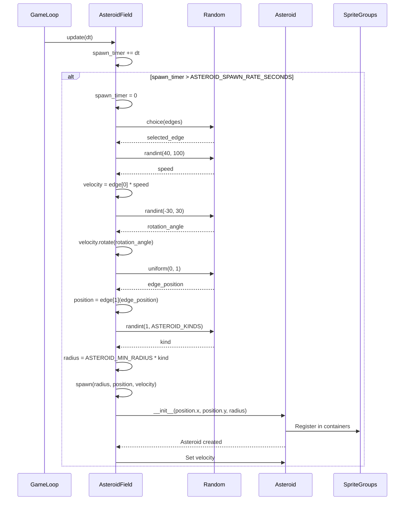

## Data Flow

### Update Cycle

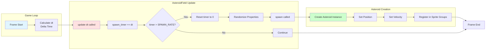

### Property Calculation Flow

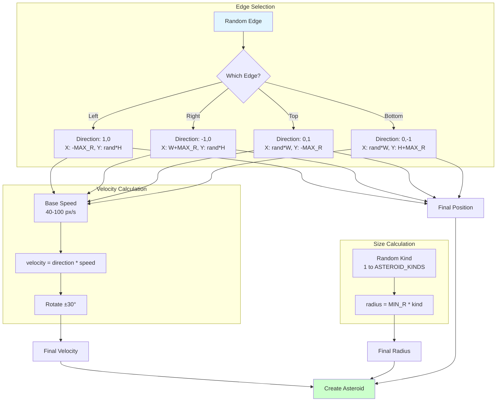

## Component Interactions

### AsteroidField-Asteroid Interaction

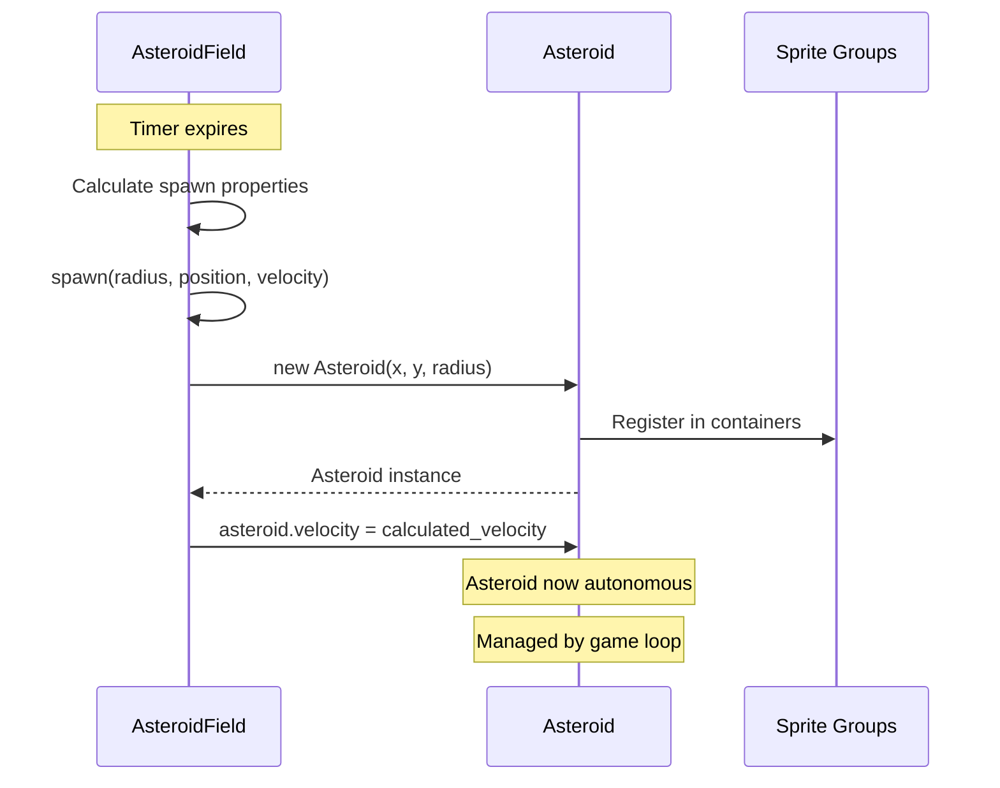

### Integration with Game Loop

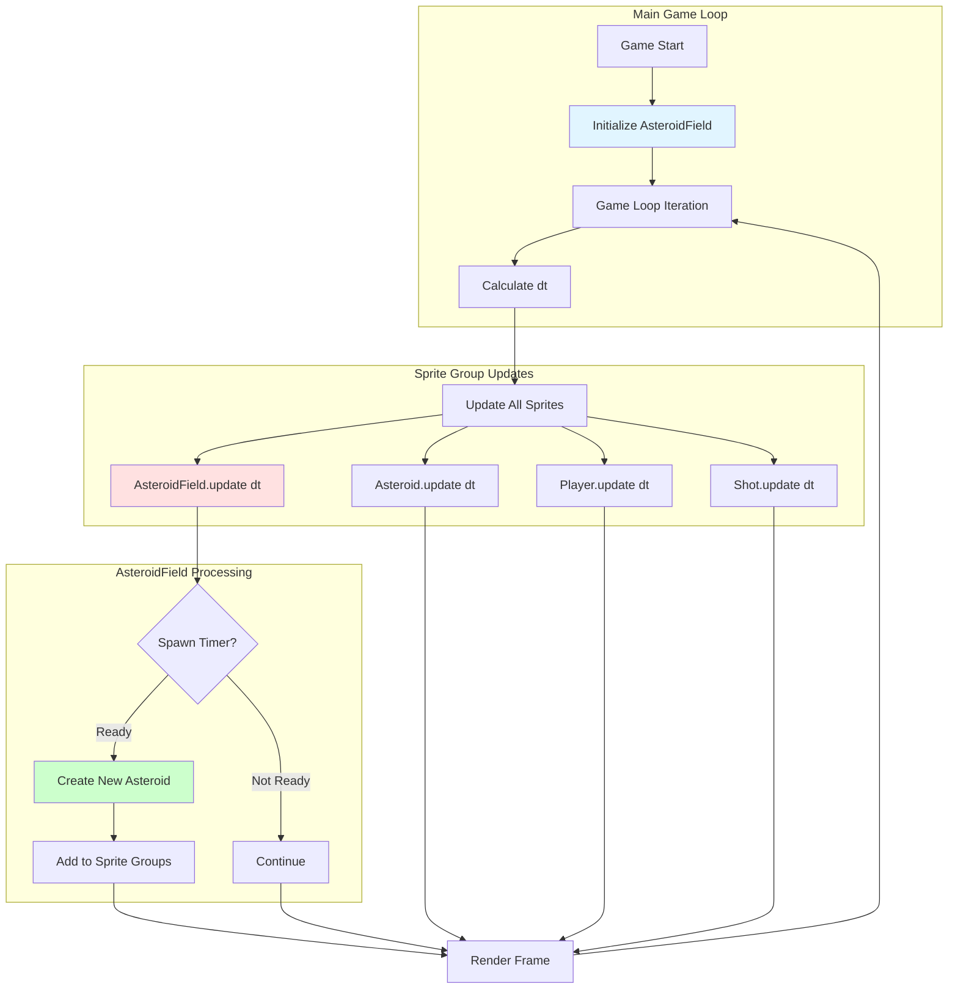

## Asteroid Lifecycle

### From Spawn to Destruction

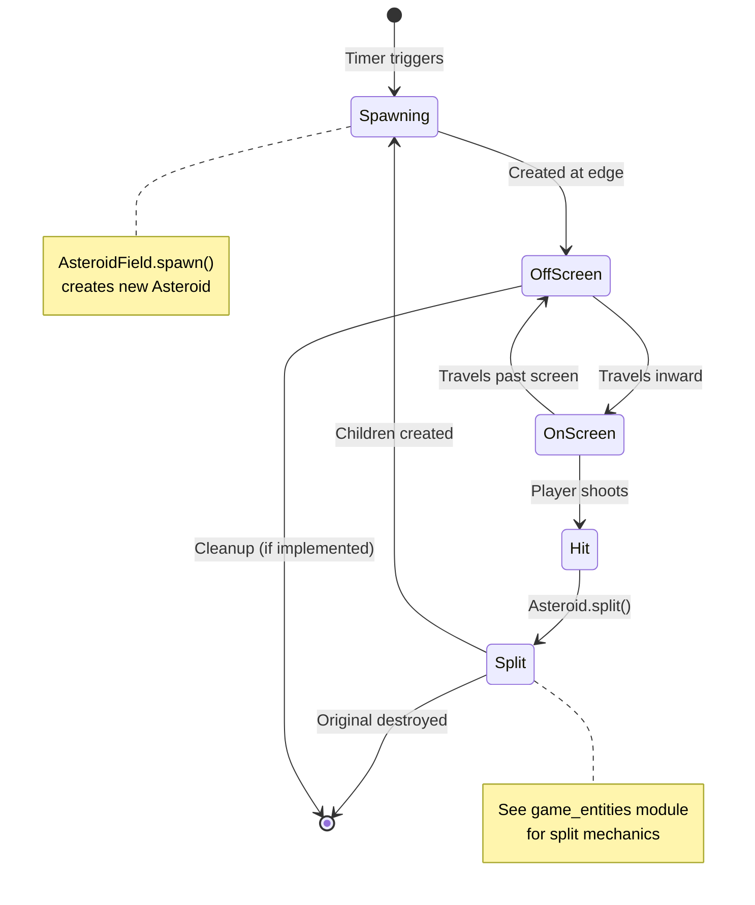

### Spawn-to-Split Integration

The `AsteroidField` is involved in both initial spawning and child asteroid creation during splits:

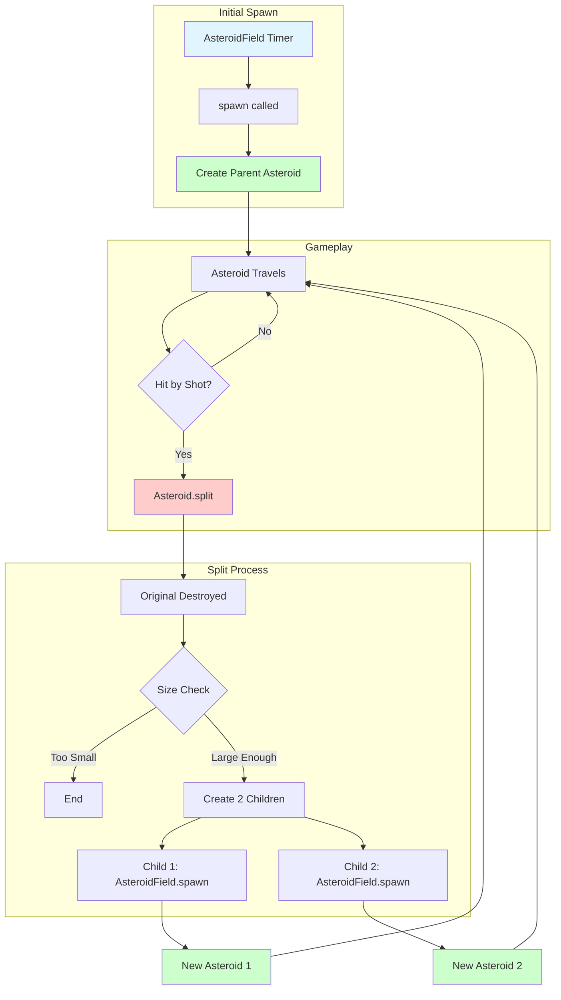

## Configuration and Tuning

### Spawn Rate Configuration

The spawn rate directly affects game difficulty:

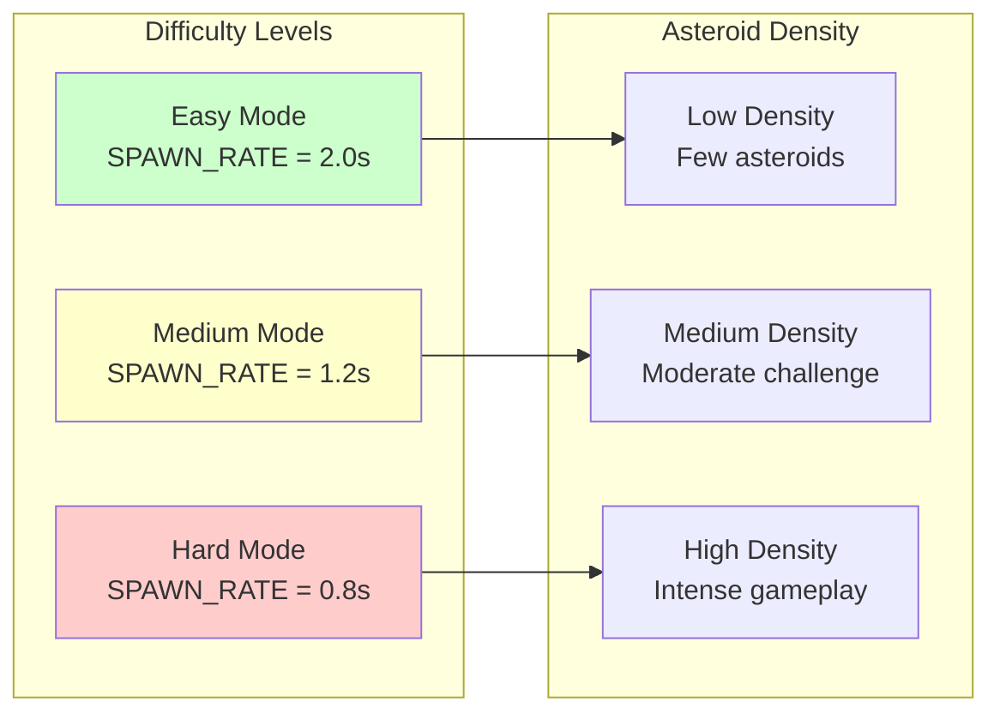

### Randomization Parameters

| Parameter | Range | Purpose |
|-----------|-------|---------|
| **Edge Selection** | 1 of 4 edges | Determines spawn location |
| **Base Speed** | 40-100 px/s | Controls asteroid velocity |
| **Direction Variance** | ±30 degrees | Adds unpredictability to trajectory |
| **Edge Position** | 0.0-1.0 | Random position along selected edge |
| **Asteroid Kind** | 1 to ASTEROID_KINDS | Determines size category |

### Size Categories

Asteroids are spawned in discrete size categories:

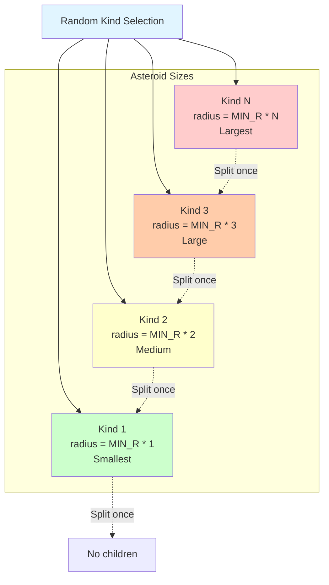

## Integration with Game Entities

The game_systems module works closely with the game_entities module (see [game_entities](game_entities.md)):

### Dependency Relationship

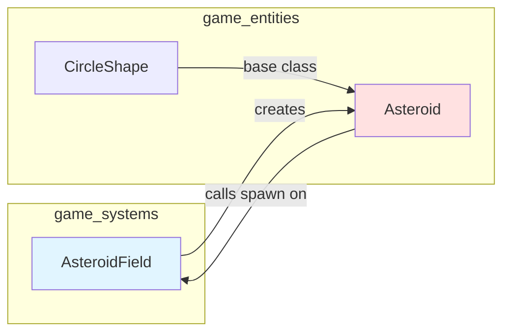

### Circular Dependency Handling

The `Asteroid.split()` method imports `AsteroidField` locally to avoid circular import issues:

```python
# In Asteroid.split()
from asteroidfield import AsteroidField  # Local import
AsteroidField().spawn(new_radius, self.position, new_velocity)
```

This design allows:
- `AsteroidField` to create initial `Asteroid` instances
- `Asteroid` to use `AsteroidField.spawn()` for creating children during splits
- Avoidance of circular import errors

## Design Patterns

### 1. Spawner Pattern

`AsteroidField` implements the Spawner pattern:
- Centralized creation logic for game entities
- Decouples entity creation from entity behavior
- Manages spawn timing and frequency
- Provides consistent initialization

### 2. Factory Method Pattern

The `spawn()` method acts as a factory:
- Encapsulates object creation logic
- Provides a consistent interface for creating asteroids
- Used by both timer-based spawning and split-based spawning

### 3. Strategy Pattern (Implicit)

Edge definitions use strategy pattern:
- Each edge has its own position calculation strategy (lambda function)
- Direction vectors define movement strategy
- Allows easy addition of new spawn patterns

### 4. Timer Pattern

Spawn timing uses accumulator pattern:
- Accumulates delta time across frames
- Triggers action when threshold reached
- Resets timer for next cycle

## Performance Considerations

### Sprite Container Integration

The `AsteroidField` inherits from `pygame.sprite.Sprite` and registers with containers:

```python
def __init__(self):
    pygame.sprite.Sprite.__init__(self, self.containers)
    self.spawn_timer = 0.0
```

**Benefits**:
- Automatic inclusion in sprite group updates
- Centralized update management via game loop
- No manual tracking required

**Considerations**:
- `AsteroidField` itself doesn't need rendering (no `draw()` method)
- Exists primarily for update cycle integration
- Could alternatively be managed outside sprite system

### Spawn Rate Impact

Spawn rate affects performance and gameplay:

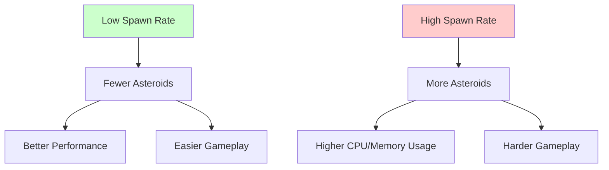

**Optimization Strategies**:
- Limit maximum active asteroids
- Implement off-screen culling
- Use object pooling for asteroid instances
- Adjust spawn rate based on performance metrics

## Usage Example

### Basic Setup

```python
import pygame
from asteroidfield import AsteroidField
from asteroid import Asteroid

# Initialize sprite groups
updatable = pygame.sprite.Group()
drawable = pygame.sprite.Group()
asteroids = pygame.sprite.Group()

# Set containers for automatic registration
AsteroidField.containers = (updatable,)
Asteroid.containers = (updatable, drawable, asteroids)

# Create asteroid field
asteroid_field = AsteroidField()

# Game loop
dt = 0
clock = pygame.time.Clock()

while running:
    dt = clock.tick(60) / 1000  # Delta time in seconds
    
    # Update all sprites (including AsteroidField)
    for sprite in updatable:
        sprite.update(dt)
    
    # AsteroidField automatically spawns asteroids
    # New asteroids are automatically added to groups
```

### Custom Spawn Configuration

```python
# Modify spawn rate
from constants import ASTEROID_SPAWN_RATE_SECONDS

# Faster spawning for hard mode
ASTEROID_SPAWN_RATE_SECONDS = 0.8

# Slower spawning for easy mode
ASTEROID_SPAWN_RATE_SECONDS = 2.0
```

### Manual Spawning

```python
# Manually spawn an asteroid
import pygame
from asteroidfield import AsteroidField

field = AsteroidField()

# Spawn a large asteroid at center moving right
position = pygame.Vector2(400, 300)
velocity = pygame.Vector2(50, 0)
radius = 60

field.spawn(radius, position, velocity)
```

## Extension Points

### Adding New Spawn Patterns

The edge system can be extended with new spawn patterns:

```python
# Add diagonal spawns
AsteroidField.edges.extend([
    # Top-left corner
    [
        pygame.Vector2(1, 1).normalize(),
        lambda _: pygame.Vector2(-ASTEROID_MAX_RADIUS, -ASTEROID_MAX_RADIUS)
    ],
    # Top-right corner
    [
        pygame.Vector2(-1, 1).normalize(),
        lambda _: pygame.Vector2(SCREEN_WIDTH + ASTEROID_MAX_RADIUS, -ASTEROID_MAX_RADIUS)
    ]
])
```

### Dynamic Difficulty Scaling

Implement progressive difficulty:

```python
class AsteroidField(pygame.sprite.Sprite):
    def __init__(self):
        super().__init__(self.containers)
        self.spawn_timer = 0.0
        self.game_time = 0.0
        self.base_spawn_rate = ASTEROID_SPAWN_RATE_SECONDS
    
    def update(self, dt):
        self.game_time += dt
        self.spawn_timer += dt
        
        # Decrease spawn rate over time (faster spawning)
        current_spawn_rate = max(0.5, self.base_spawn_rate - (self.game_time / 60))
        
        if self.spawn_timer > current_spawn_rate:
            # Spawn logic...
            pass
```

### Spawn Zones

Create specific spawn zones for different asteroid types:

```python
class AsteroidField(pygame.sprite.Sprite):
    def spawn_in_zone(self, zone_name):
        zones = {
            'left': self.edges[0],
            'right': self.edges[1],
            'top': self.edges[2],
            'bottom': self.edges[3]
        }
        edge = zones[zone_name]
        # Spawn logic using specific edge...
```

## Testing Considerations

### Unit Testing

Key test cases for `AsteroidField`:

```python
def test_spawn_creates_asteroid():
    """Verify spawn creates asteroid with correct properties"""
    field = AsteroidField()
    position = pygame.Vector2(100, 100)
    velocity = pygame.Vector2(50, 0)
    radius = 40
    
    field.spawn(radius, position, velocity)
    # Assert asteroid created with correct properties

def test_timer_triggers_spawn():
    """Verify timer triggers spawn at correct interval"""
    field = AsteroidField()
    dt = ASTEROID_SPAWN_RATE_SECONDS + 0.1
    
    field.update(dt)
    # Assert spawn was triggered

def test_randomization():
    """Verify spawn properties are randomized"""
    field = AsteroidField()
    spawns = []
    
    for _ in range(100):
        field.update(ASTEROID_SPAWN_RATE_SECONDS + 0.1)
        # Collect spawn properties
    
    # Assert variety in edge selection, speed, rotation, etc.
```

### Integration Testing

```python
def test_asteroid_field_integration():
    """Verify AsteroidField integrates with sprite groups"""
    updatable = pygame.sprite.Group()
    asteroids = pygame.sprite.Group()
    
    AsteroidField.containers = (updatable,)
    Asteroid.containers = (updatable, asteroids)
    
    field = AsteroidField()
    
    # Simulate multiple updates
    for _ in range(10):
        field.update(ASTEROID_SPAWN_RATE_SECONDS + 0.1)
    
    # Assert asteroids were created and added to groups
    assert len(asteroids) > 0
```

## Summary

The **game_systems** module provides essential procedural generation capabilities for the Asteroids game:

**Key Features**:
- ✅ Timer-based automatic spawning
- ✅ Randomized asteroid properties (size, speed, direction, position)
- ✅ Edge-based spawn system for natural gameplay flow
- ✅ Integration with sprite container system
- ✅ Support for both initial spawning and split-based spawning

**Design Strengths**:
- Clear separation between spawning logic and entity behavior
- Highly configurable through constants
- Extensible edge and spawn pattern system
- Efficient timer-based triggering

**Integration Points**:
- Creates `Asteroid` entities from [game_entities](game_entities.md)
- Used by `Asteroid.split()` for child creation
- Managed by main game loop through sprite groups
- Configured via centralized constants module

The module exemplifies good game architecture by separating content generation from entity logic, enabling independent testing, modification, and extension of both systems.
