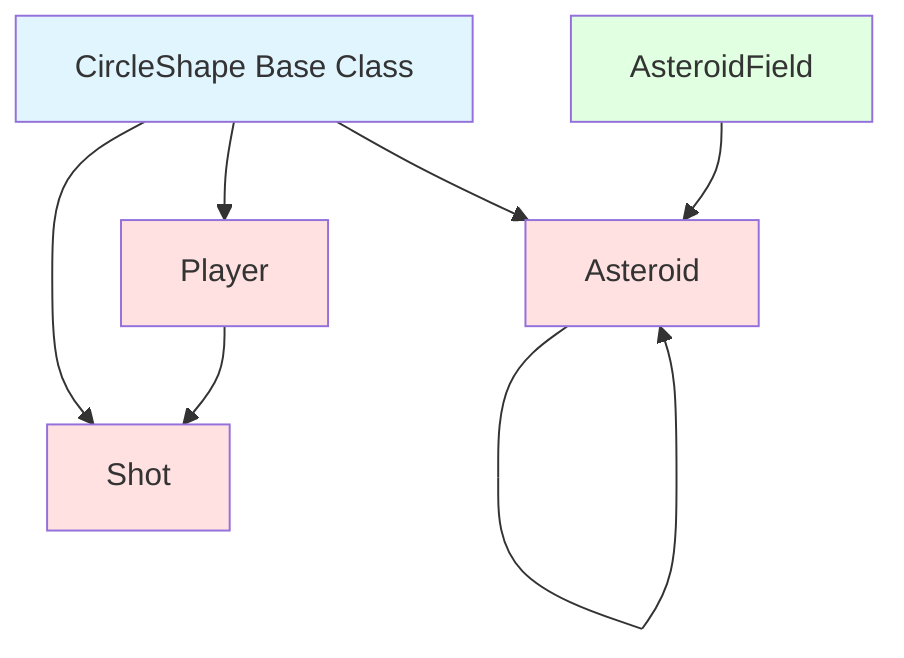
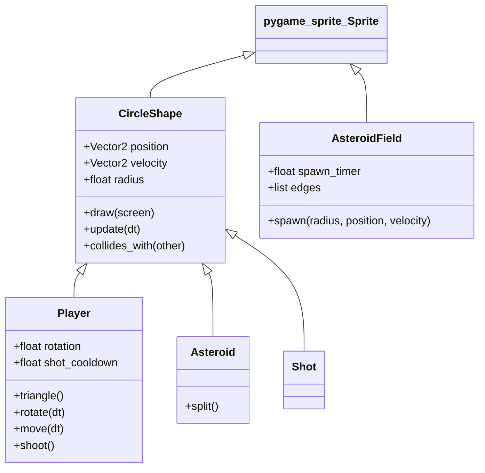
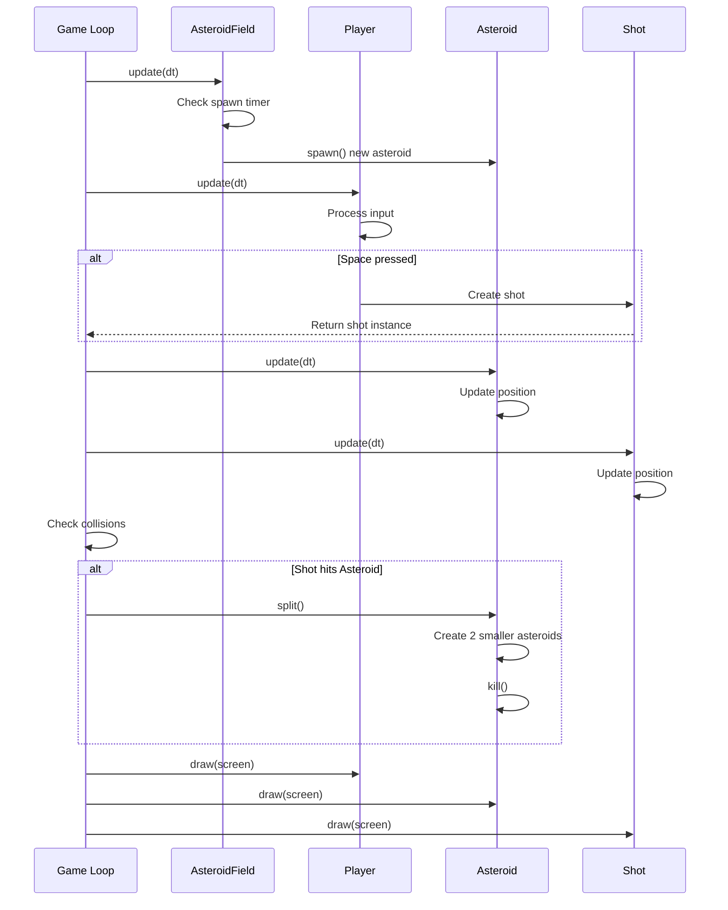
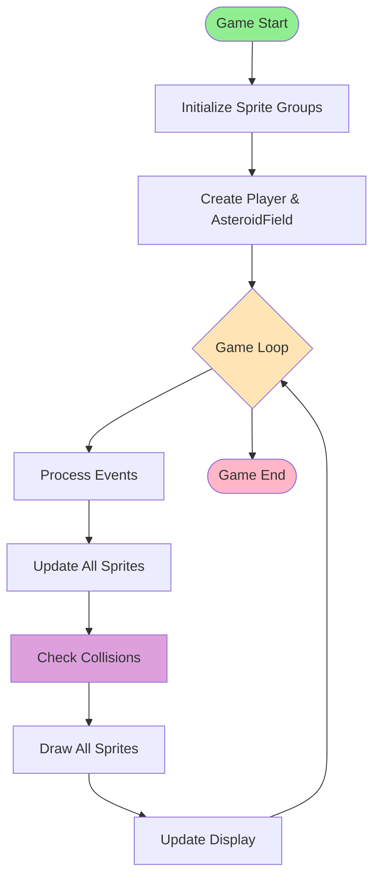

# Asteroids Module Documentation

## Overview

The **asteroids** module is a classic arcade-style game implementation built with Pygame. It provides a complete game system featuring player-controlled spacecraft, asteroid obstacles, collision detection, and shooting mechanics. The module follows object-oriented design principles with a sprite-based architecture for efficient game object management.

## Purpose

This module implements the core gameplay mechanics of an Asteroids-style game, including:
- Player ship control with rotation and movement
- Dynamic asteroid spawning and management
- Projectile shooting system
- Collision detection between game objects
- Asteroid splitting mechanics when hit

## Architecture Overview

The asteroids module is structured around a base class hierarchy with specialized game entities. All interactive game objects inherit from a common `CircleShape` base class, enabling consistent collision detection and sprite management.



### Component Hierarchy



## Module Structure

The asteroids module consists of the following core components organized into two main sub-systems:

### 1. Game Entities Sub-Module
Handles all interactive game objects and their behaviors. This sub-module provides the foundational entity framework with a unified base class and specialized game objects.

**Components:**
- **[CircleShape](game_entities.md#circleshape)** - Base class for all circular game objects with collision detection
- **[Player](game_entities.md#player)** - Player-controlled spacecraft with movement, rotation, and shooting
- **[Asteroid](game_entities.md#asteroid)** - Destructible asteroid obstacles with splitting mechanics
- **[Shot](game_entities.md#shot)** - Player projectiles for destroying asteroids

**Key Features:**
- Unified collision detection system
- Sprite container integration
- Physics-based movement with velocity vectors
- Template method pattern for consistent entity behavior

For detailed component specifications and implementation details, see **[Game Entities Documentation](game_entities.md)**.

### 2. Game Systems Sub-Module
Manages game mechanics and spawning systems. This sub-module implements procedural content generation for continuous gameplay.

**Components:**
- **[AsteroidField](game_systems.md#asteroidfield)** - Asteroid spawning and management system

**Key Features:**
- Timer-based procedural spawning
- Edge-based spawn locations (4 screen edges)
- Randomized asteroid properties (size, speed, direction)
- Configurable difficulty through spawn rates

For detailed system specifications and spawning mechanics, see **[Game Systems Documentation](game_systems.md)**.

## Data Flow

The following diagram illustrates how data and control flow through the asteroids module during gameplay:



## Key Features

### Collision Detection System
All game entities inherit from `CircleShape`, which provides a unified collision detection method using circular hitboxes. The collision detection is based on distance calculation between object centers:

```python
distance = self.position.distance_to(other.position)
return distance < (self.radius + other.radius)
```

### Sprite Container Pattern
The module uses Pygame's sprite container system for efficient group management. Game objects can be automatically added to sprite groups through the `containers` attribute, enabling batch updates and rendering.

### Physics-Based Movement
All entities use velocity vectors and delta-time (dt) based updates for smooth, frame-rate independent movement:
- Position updates: `position += velocity * dt`
- Rotation-based directional movement for player
- Velocity inheritance and modification for asteroid splitting

### Dynamic Difficulty
The asteroid spawning system creates varied gameplay through:
- Random edge spawning (top, bottom, left, right)
- Variable asteroid sizes (based on `ASTEROID_KINDS`)
- Random speed ranges (40-100 units)
- Random velocity angle variations (±30 degrees)

## Integration Points

### External Dependencies

The asteroids module depends on the following external modules:

- **pygame** - Core game engine for rendering, sprites, and input handling
- **constants** - Game configuration values (speeds, sizes, cooldowns)
- **logger** - Event logging system for game analytics (see [logger.log_event](logger.md#log_event))

### Constants Module Integration

The module relies heavily on configuration constants for game balance:
- `SCREEN_WIDTH`, `SCREEN_HEIGHT` - Display dimensions
- `PLAYER_RADIUS`, `PLAYER_SPEED`, `PLAYER_TURN_SPEED` - Player properties
- `ASTEROID_MIN_RADIUS`, `ASTEROID_MAX_RADIUS`, `ASTEROID_KINDS` - Asteroid properties
- `SHOT_RADIUS`, `PLAYER_SHOT_SPEED` - Projectile properties
- `PLAYER_SHOOT_COOLDOWN_SECONDS`, `ASTEROID_SPAWN_RATE_SECONDS` - Timing values
- `LINE_WIDTH` - Rendering property

### Event Logging Integration

The module integrates with the logging system to track game events:
- Asteroid split events are logged via `log_event("asteroid_split")`
- Enables gameplay analytics and debugging

## Game Loop Integration

The asteroids module is designed to integrate with a standard Pygame game loop:



## Usage Example

```python
import pygame
from player import Player
from asteroid import Asteroid
from asteroidfield import AsteroidField
from shot import Shot

# Initialize sprite groups
updatable = pygame.sprite.Group()
drawable = pygame.sprite.Group()
asteroids = pygame.sprite.Group()
shots = pygame.sprite.Group()

# Set containers for automatic group assignment
Player.containers = (updatable, drawable)
Asteroid.containers = (asteroids, updatable, drawable)
AsteroidField.containers = (updatable,)
Shot.containers = (shots, updatable, drawable)

# Create game objects
player = Player(SCREEN_WIDTH / 2, SCREEN_HEIGHT / 2)
asteroid_field = AsteroidField()

# Game loop
while running:
    dt = clock.tick(60) / 1000
    
    # Update all entities
    for obj in updatable:
        obj.update(dt)
    
    # Check collisions
    for asteroid in asteroids:
        if player.collides_with(asteroid):
            # Handle player death
            pass
        
        for shot in shots:
            if shot.collides_with(asteroid):
                asteroid.split()
                shot.kill()
    
    # Render
    for obj in drawable:
        obj.draw(screen)
```

## Design Patterns

### 1. Template Method Pattern
The `CircleShape` base class defines the template for game objects with abstract methods (`draw`, `update`) that subclasses must implement.

### 2. Object Pool Pattern
Pygame's sprite groups act as object pools, managing the lifecycle of game entities efficiently.

### 3. Factory Pattern
The `AsteroidField.spawn()` method acts as a factory for creating asteroid instances with specific properties.

### 4. Component Pattern
Game objects are composed of position, velocity, and radius components, with behavior added through inheritance.

## Performance Considerations

- **Sprite Groups**: Efficient batch processing of game objects
- **Delta Time**: Frame-rate independent updates ensure consistent gameplay
- **Circular Collision**: Simple distance-based collision detection for performance
- **Lazy Imports**: Circular dependencies avoided through local imports in methods

## Future Enhancement Opportunities

1. **Power-ups System**: Extend `CircleShape` for collectible items
2. **Particle Effects**: Add visual feedback for explosions and collisions
3. **Score System**: Track and display player performance
4. **Sound Effects**: Audio feedback for actions and collisions
5. **Multiple Lives**: Player respawn mechanism
6. **Level Progression**: Increasing difficulty over time
7. **High Score Persistence**: Save and load player records

## Related Modules

- **[logger](logger.md)** - Event logging and analytics system
- **constants** - Game configuration and tuning parameters

---

*This documentation covers the asteroids game module. For detailed component information, refer to the sub-module documentation linked above.*
